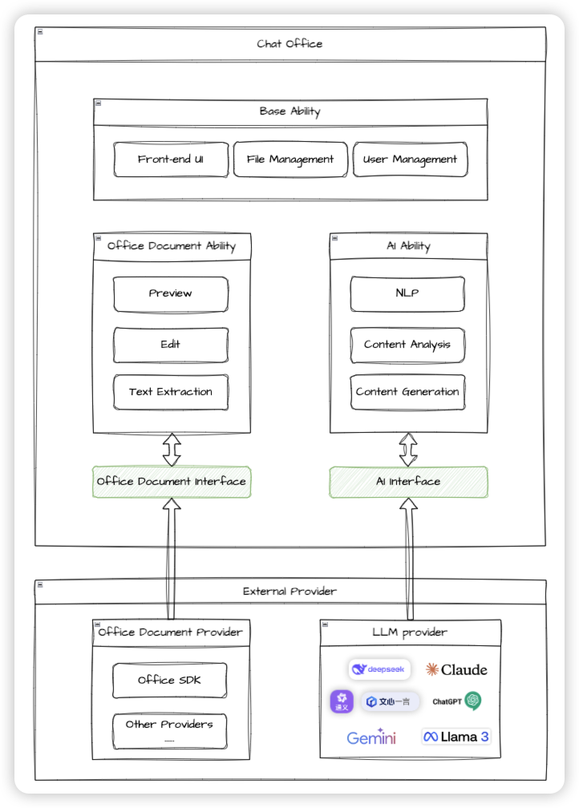

# AIChatOffice

[中文](README.md) | [English](README_EN.md)

<p align="center">
  
</p>

<p align="center">
  <a href="https://github.com/yourusername/aichatoffice/blob/main/LICENSE">
    
  </a>
  <a href="https://github.com/yourusername/aichatoffice/releases">
    
  </a>
</p>

## 简介

AIChatOffice 是一个智能办公助手应用，旨在通过 AI 技术提升文档处理和办公效率。它能够智能处理各类办公文档，提供多轮对话支持，帮助用户更高效地完成办公任务。

## ✨ 特性

- 📝 智能文档处理

  - 多种格式文档预览
  - 文档内容智能分析

- 💬 智能对话

  - 自然语言多轮对话
  - 上下文理解和记忆
  - 文档相关问答

- 插件式架构

  - 支持接入不同的文档处理、大语言模型供应方

## 🚀 快速开始

### 环境要求

- Node.js >= 16
- Go >= 1.18
- Git

### 安装

```bash
# 克隆项目
git clone https://github.com/yourusername/aichatoffice.git
cd aichatoffice

# 安装前端依赖
cd app
npm install

# 安装后端依赖
cd ..
go mod tidy
```

### 开发

```bash
# 启动前端开发服务
cd app
npm run dev

# 启动后端服务
make server
```

### 构建

```bash
# 构建桌面应用
cd app
npm run build
```

## 🔧 技术架构

### 架构图



### 前端

- Electron - 跨平台桌面应用框架
- React - 用户界面库
- TypeScript - 开发语言
- TailwindCSS - CSS 框架
- Vite - 构建工具

### 后端

- Go - 开发语言
- Gin - HTTP 框架
- EGO - 微服务框架
- SQLite - 数据存储

### 依赖服务

该项目的核心功能依赖以下两种外部服务，以下是它们需要实现的功能：

- 文档处理服务

  - 预览文档
  - 获取文档内容

- AI 能力服务

  - 兼容 openai 协议的大语言模型

## 疑问解答

```
AIChatOffice.app is is damaged and can't be opened. You should move it to the Trash
```

命令行执行：

```shell
xattr -cr /Applications/AIChatOffice.app
```

## 📖 文档

//TODO - [API 文档](docs/api.md)
//TODO - [贡献指南](CONTRIBUTING.md)

## 开发计划

//todo roadmap

## 🤝 贡献

我们欢迎任何形式的贡献，包括但不限于：

- 提交问题和建议
- 改进文档
- 提交代码改进
- 分享使用经验

请阅读 [贡献指南](CONTRIBUTING.md) 了解更多信息。

## 📜 开源协议

本项目采用 [MIT 协议](LICENSE)。

## 🙏 致谢

感谢以下开源项目：

- [EGO](https://github.com/gotomicro/ego)
- [Vercel-AI-SDK](https://github.com/vercel/ai)
- [Electron](https://www.electronjs.org/)
- [React](https://reactjs.org/)
- [Gin](https://gin-gonic.com/)
- [TailwindCSS](https://tailwindcss.com/)

## 📞 联系我们

- 提交 Issue: [GitHub Issues](https://github.com/aichatoffice/aichatoffice/issues)
