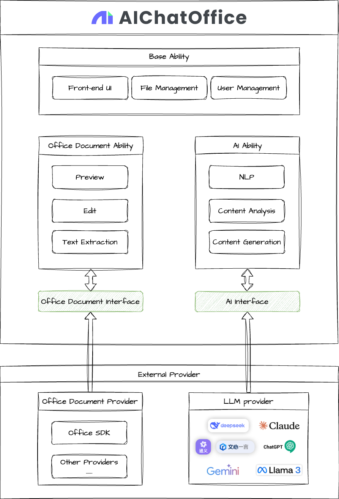

# AIChatOffice

[中文](README.md) | [English](README_EN.md)

<p align="center">
  
</p>

<p align="center">
  <a href="https://github.com/yourusername/aichatoffice/blob/main/LICENSE">
    
  </a>
  <a href="https://github.com/yourusername/aichatoffice/releases">
    
  </a>
</p>

## 💡 Redefining the Smart Office Experience -- AI ChatOffice

In today's fast-paced business environment, efficiency is no longer an option but a necessity for survival. Imagine having an intelligent assistant available around the clock, understanding your needs, predicting your intentions, and completing tasks with unprecedented speed and accuracy. This is no longer a scene from a sci-fi novel, but a reality brought to you by AI ChatOffice (OfficeAI Assistant).

### 🌟 A New Era of Smart Office

The birth of AI ChatOffice stems from a simple yet profound insight: modern office software, while powerful, often has a steep learning curve and complex operations that can hinder rather than help creativity and efficiency. Our development team, composed of professionals passionate about artificial intelligence and office automation, is well aware of the pain points and challenges in today's office environment.

AI ChatOffice is not just office software; it is a revolutionary shift in office philosophy. Against the backdrop of rapid advancements in artificial intelligence and natural language processing technologies, we have created this intelligent assistant to fundamentally change the way you interact with office software.

Imagine, when you need to write a detailed quarterly report, you no longer need to start from scratch to conceptualize the framework, collect data, and format charts. Instead, simply tell AI ChatOffice your requirements, and it will immediately understand and begin working. When you need to analyze complex financial data, you no longer need to remember obscure Excel formulas or functions; just describe your needs in natural language, and AI will do the rest. This is the new office experience brought by AI ChatOffice.

### 🤔 Why Choose AI ChatOffice?

Among many office assistant tools, AI ChatOffice stands out for its unique advantages:

#### 🔍 Deep Integration, Seamless Experience

AI ChatOffice directly supports common formats including docx, xlsx, markdown, pdf, etc. This means you can enjoy the powerful features brought by AI without learning a new interface. Whether you are writing documents in Word or analyzing data in Excel, AI ChatOffice is always ready to help.

#### 💡 Understanding Intentions, Not Just Executing Commands

AI ChatOffice can not only execute the tasks you specify but also understand your underlying intentions. For example, when you ask to "organize this report," it not only adjusts the format but also analyzes the content, optimizes the structure, and even offers improvement suggestions. This deep understanding makes AI ChatOffice a true intelligent assistant, not just a simple command executor.

#### 🔌 Plugin Architecture

AI ChatOffice adopts a plugin architecture, supporting integration with various document processing and large language model providers.

#### 🔒 Privacy First, Secure and Reliable

In today's world where data security is increasingly important, AI ChatOffice puts user privacy first. All sensitive data processing can be done locally, without the need to upload to the cloud. You have full control over which information can be accessed by AI and which needs to remain private. This flexible privacy control mechanism makes AI ChatOffice an ideal choice for enterprise-level users.

### 📚 Current Version and Development History

**Current Version:** v0.1.2 | **Release Date:** 2025-3-30 | **Software Size:** 180MB | **Supported Languages:** Chinese/English

The development history of AI ChatOffice reflects our relentless pursuit of excellence. From the initial concept verification to the feature-rich v0.1.2 version, each update has been a culmination of the development team's wisdom and valuable user feedback.

Version v0.3.20 brought several important improvements, including significantly optimized AI response speed, making interactions smoother and more natural; and fixes for known issues, ensuring a stable and reliable user experience.

Our development roadmap is ambitious, and future versions will introduce more revolutionary features, such as document editing, further expanding the boundaries of AI-assisted office work.

### 🌟 Future Outlook: The Infinite Possibilities of Smart Office

AI ChatOffice represents the future direction of smart office. As artificial intelligence technology continues to advance, we see the infinite possibilities for office automation and intelligence.

In the near future, AI ChatOffice will further break down barriers between applications, enabling intelligent collaboration across software. Imagine being able to ask AI to analyze data in Excel, generate reports in Word, and create presentations in PowerPoint, all through a unified intelligent interface.

We are also exploring expanding AI ChatOffice to more platforms and application scenarios, including mobile devices, browser plugins, and even professional fields such as legal document processing and medical report analysis.

AI ChatOffice is not just software; it is our bold vision and practice for the future of work. We believe that by eliminating technical barriers and simplifying complex processes, AI ChatOffice can enable everyone to focus on what truly matters: creativity, decision-making, and innovation.

Join us in exploring the new era of smart office!

## 🚀 Quick Start

### Environment Requirements

- Node.js >= 18
- Go >= 1.18
- Git

### Installation

```bash
# Clone the project
git clone https://github.com/yourusername/aichatoffice.git
cd aichatoffice

# Install frontend dependencies
cd app
npm install

# Install backend dependencies
cd ..
go mod tidy
```

### Development

```bash
# Start the frontend development service
cd app
npm run dev

# Start the backend service
make server
```

### Build

```bash
# Build the desktop application
cd aichatoffice
# Build the desktop application for the current platform
make build-xxx

cd app
npm run build
```

## 🔧 Technical Architecture

### Architecture Diagram



### Frontend

- Electron - Cross-platform desktop application framework
- React - User interface library
- TypeScript - Development language
- TailwindCSS - CSS framework
- Vite - Build tool

### Backend

- Go - Development language
- Gin - HTTP framework
- EGO - Microservice framework
- SQLite - Data storage

### Dependency Services

The core functionality of this project depends on the following external services, here are the functions they need to implement:

- Document Processing Service

  - Preview documents
  - Retrieve document content

- AI Capability Service

  - Compatible with openai protocol large language model

## FAQ

```
AIChatOffice.app is damaged and can't be opened. You should move it to the Trash
```

Command line execution:

```shell
xattr -cr /Applications/AIChatOffice.app
```

## [💡 AI ChatOffice - Practical Application Scenarios and Case Studies](docs/use_cases_en.md)

## [🔍 AI ChatOffice - Technical Deep Analysis](docs/technical_analysis_en.md)

## 📖 Documentation

//TODO - [API Documentation](docs/api.md)
//TODO - [Contribution Guide](CONTRIBUTING.md)


## 🤝 Contributing

We welcome any form of contribution, including but not limited to:

- Submitting issues and suggestions
- Improving documentation
- Submitting code improvements
- Sharing usage experiences

Please read [Contribution Guide](CONTRIBUTING.md) for more information.

## 📜 License

This project is licensed under the [MIT License](LICENSE).

## 🙏 Acknowledgments

Thanks to the following open-source projects:

- [EGO](https://github.com/gotomicro/ego)
- [Vercel-AI-SDK](https://github.com/vercel/ai)
- [Electron](https://www.electronjs.org/)
- [React](https://reactjs.org/)
- [Gin](https://gin-gonic.com/)
- [TailwindCSS](https://tailwindcss.com/)

## 📞 Contact Us

- Submit Issue: [GitHub Issues](https://github.com/aichatoffice/aichatoffice/issues)
